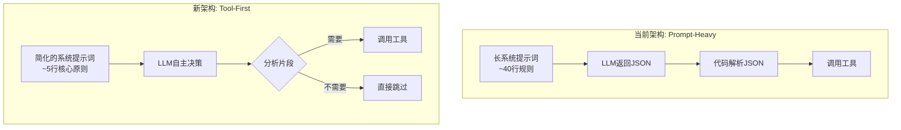
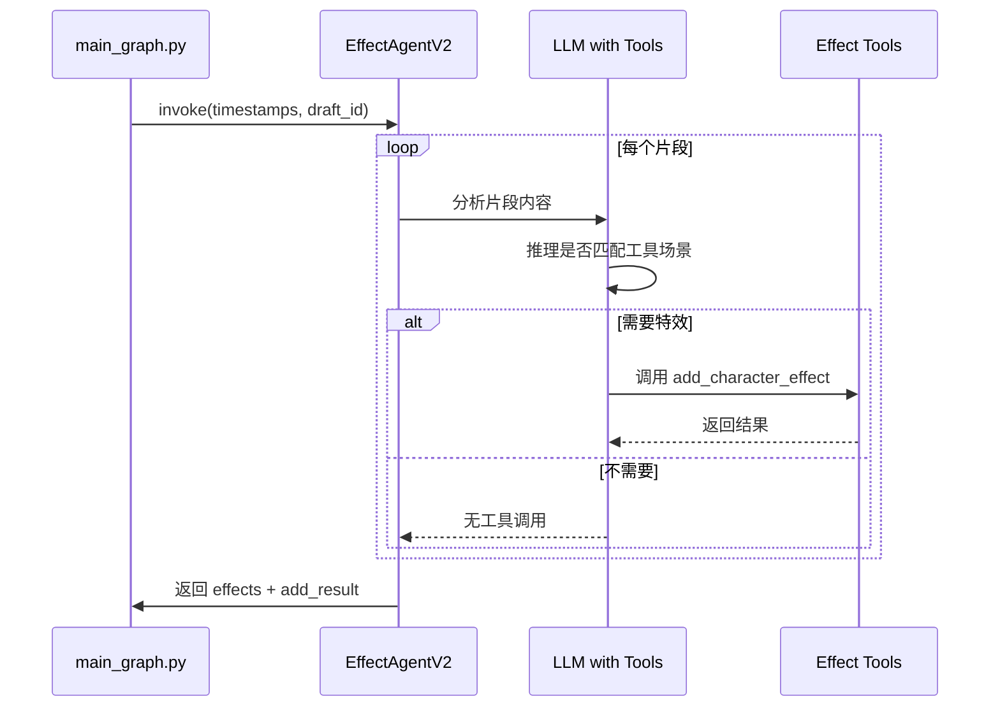

## 产品概述

将 effect_agent.py 从「长系统提示词 + 固定流程」架构重构为「Claude 式 Tool-First」架构，提升 AI 自主决策能力和系统可扩展性。

## 核心需求

1. **减少系统提示词**：将当前约 40 行的长 prompt 简化为核心上下文（5-10 行）
2. **增强工具描述**：在工具定义中详细描述使用场景、适用条件、不适用条件
3. **AI 自主决策**：LLM 根据片段文案和工具描述，自主判断是否需要调用工具
4. **保持兼容性**：重构后的 Agent 接口与现有主工作流 (main_graph.py) 保持兼容
5. **可扩展性**：新增特效只需添加工具，无需修改系统提示词

## 当前问题

- 提示词维护困难，规则硬编码在字符串中
- LLM 是被动执行者，返回 JSON 后由代码解析
- 添加新特效类型需要修改提示词和解析逻辑
- 无法灵活组合多个工具

## 技术栈

- **框架**: LangGraph + LangChain
- **Agent 模式**: ReAct (Reasoning + Acting) with Tool Calling
- **语言**: Python 3.10+
- **依赖**: langchain-openai, pydantic

## 架构设计

### 新旧架构对比



### 核心组件设计

#### 1. 工具层重构 (tools/effect_agent_tools.py)

```python
# 新工具定义模式 - 描述即规则
@tool
def add_character_effect(
    effect_name: Literal["心动", "光环 I", "气炸了", "笑哭", "难过"],
    start_time: float,
    duration: float,
    reason: str
) -> str:
    """为医疗科普视频片段添加人物特效
    
    ⚠️ 核心原则：宁缺毋滥，绝大多数片段不需要特效
    
    ## 特效选择指南
    
    ### 1. 心动 - 强调关键信息
    ✅ 适用: "90%的人都不知道" "核心结论是" "记住这个数字"
    ❌ 不适用: 普通数据罗列、病理机制解释
    
    ### 2. 光环 I - 温暖建议
    ✅ 适用: "建议大家多喝水" "记得照顾好自己" "温馨提示"
    ❌ 不适用: 专业医学说明、诊断标准
    
    ### 3. 气炸了 - 风险警示
    ✅ 适用: "这三类人绝对不能吃" "副作用包括" "警告"
    ❌ 不适用: 普通注意事项
    
    ### 4. 笑哭/难过 - 情绪表达（极少使用）
    ✅ 适用: 轻松吐槽、幽默段子
    ❌ 不适用: 严肃医学内容
    
    ## 强制排除条件
    - 时长 < 2秒的片段
    - 解释病理、症状、诊断的内容
    """
```

#### 2. Agent 核心重构 (agents/effect_agent_v2.py)

```python
class EffectAgentV2:
    """Tool-First 特效 Agent"""
    
    def __init__(self):
        self.tools = self._create_tools()
        self.agent = self._create_agent()
    
    def _create_agent(self):
        # 使用 create_tool_calling_agent 替代手动 prompt 工程
        prompt = ChatPromptTemplate.from_messages([
            ("system", """你是医疗科普视频的特效助手。
            
核心原则：
1. 医学专业性第一，特效仅作节奏调节
2. 宁缺毋滥 - 不确定时不加特效
3. 每个片段独立分析，根据工具描述决定是否调用

你有完全的决策权。"""),
            ("human", "{input}"),
            MessagesPlaceholder(variable_name="agent_scratchpad"),
        ])
        return create_tool_calling_agent(llm, self.tools, prompt)
```

#### 3. 批量处理优化

```python
def _analyze_segments_batch(
    self,
    segments: list[dict],
    max_effects: int
) -> list[dict]:
    """批量分析片段，减少 LLM 调用次数"""
    # 将多个片段打包为一次 Agent 调用
    # 使用结构化输出控制特效数量
```

### 数据流设计



## 目录结构

```
c:/Users/64061/capcut-agents/
├── agents/
│   ├── effect_agent.py              # [MODIFY] 保留旧版，标记为 deprecated
│   ├── effect_agent_v2.py           # [NEW] Tool-First 重构版本
│   └── main_graph.py                # [MODIFY] 切换为 EffectAgentV2
├── tools/
│   ├── effect_tools.py              # [EXISTING] 保持兼容
│   └── effect_agent_tools.py        # [NEW] Tool-First 专用工具定义
└── tests/
    └── test_effect_agent_v2.py      # [NEW] 单元测试
```

## 关键实现细节

### 1. 工具描述最佳实践

- 使用 ✅❌ 明确标注适用/不适用场景
- 包含具体示例文案
- 强调「强制排除条件」
- 使用 emoji 增强可读性

### 2. Token 优化策略

- 批量处理片段（每批 3-5 个）
- 使用结构化输出控制 max_effects
- 缓存工具描述，避免重复发送

### 3. 错误处理

- 工具参数验证失败时自动重试
- 记录 LLM 的推理过程便于调试
- 保持与旧版相同的返回格式

### 4. 兼容性保证

- EffectAgentV2 保持相同的 invoke() 接口
- 返回数据结构保持一致
- main_graph.py 仅需修改 import 和类名